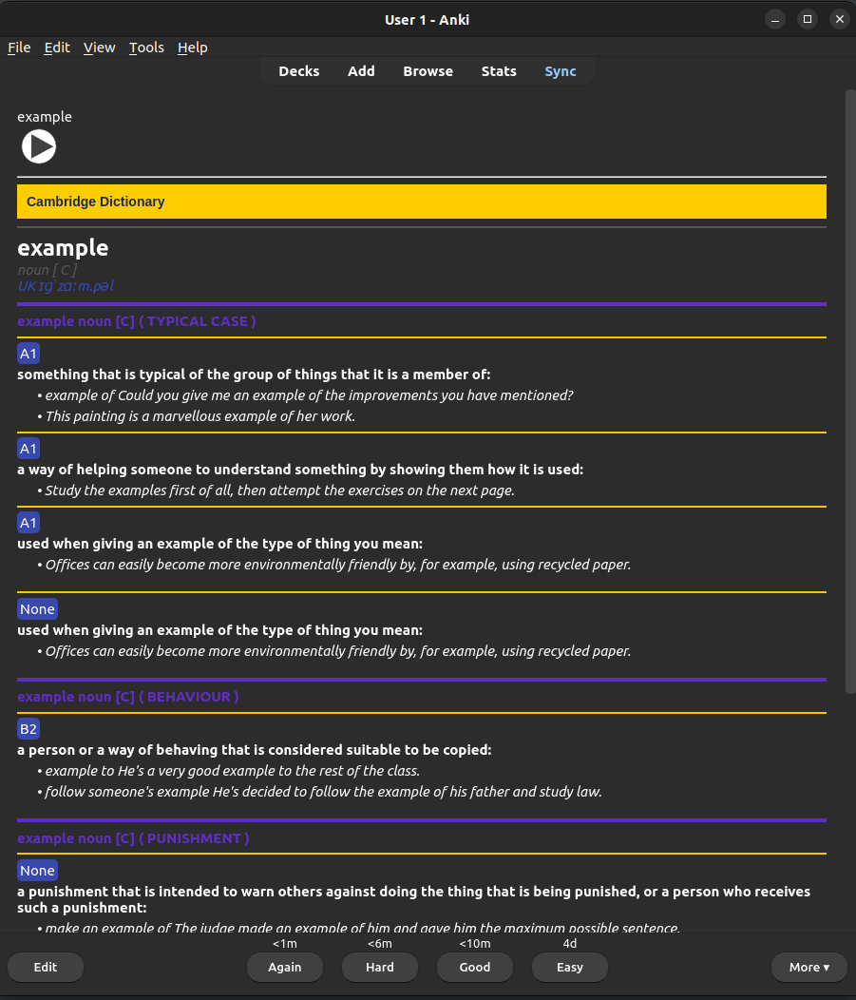

# Anki-Cambridge

Create an Anki deck with HTML styling for a list of words based on Cambridge and Oxford dictionaries, including meanings, examples, synonyms, and pronunciation. You can also add personal notes to the back of each card.

## Features

- Fetch word definitions, examples, synonyms, and pronunciation from Cambridge and Oxford dictionaries.
- Generate Anki decks with HTML-styled cards.

<div style="text-align: center;">
    
</div>
## Installation

1. Clone the repository:
```bash
git clone https://github.com/Amir-Entezari/anki-cambridge.git
```
2. Navigate to the project directory and install dependencies:
```bash
pip install -r requirements.txt
```


## Usage

1. Prepare a CSV file containing the list of words.
2. Run the `main.py` file.
3. Enter the address of .csv file
4. Enter the name of your deck
5. The generated Anki deck file (.apkg) will be saved in the project directory.

## Contributing

Feel free to open issues or submit pull requests for any improvements or bug fixes.

## License

This project is licensed under the MIT License. See the LICENSE file for details.

## Acknowledgements

- [Cambridge Dictionary](https://dictionary.cambridge.org/)
- [Oxford Dictionary](https://www.oxfordlearnersdictionaries.com/)

